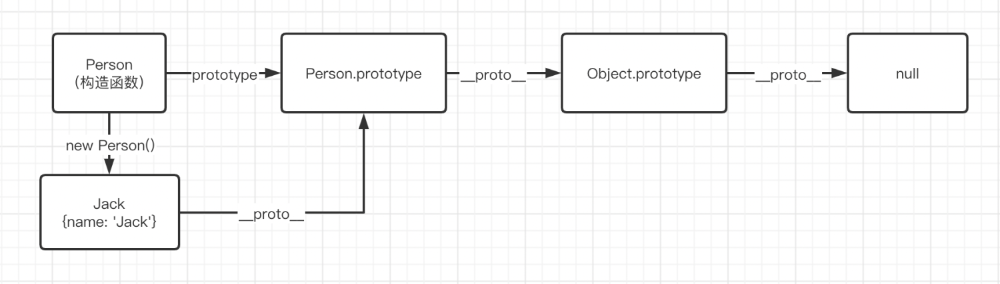
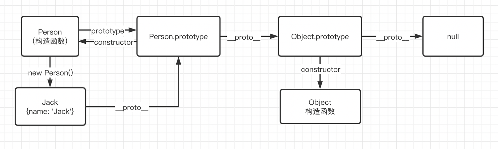

# ** __proto__和prototype**


任何一个对象的 `__proto__`属性指向这个对象的构造函数的原型对象`Person.prototype`。原型链的顶端是 `null`
​



`__proto__`这个属性连接起来的各个层级对象的原型，即原型链。
​

当JS引擎访问对象的属性的时候，会首先看这个对象本身有没有，如果没有，则沿着 `__proto__`一直向上查找，直到找到原型链顶端。


模拟 **原型链查找过程**
```javascript

function getValue(obj, prop){
  do{
  	if(obj[prop]){
    	return obj[prop]
    }
    obj = obj.__proto__
  }while(obj !== null)
  return null
}
```


对象的 `prototype`上有一个 `constructor` 的属性，它指向了这个对象的构造函数。
​


# 继承


> 面向对象有三大特征：封装、继承、多态。


继承可以使得子类具有父类的**属性**和**方法**或者重新定义、追加属性和方法等。
​

子类的创建可以增加新数据、新功能，可以继承父类全部的功能，但是不能选择性的继承父类的部分功能。**继承是类与类之间的关系，不是对象与对象之间的关系。**
**​**

所以在 `ES6` 以前，“继承”并非面向对象中的“继承”。只是继承的一种模拟实现。
